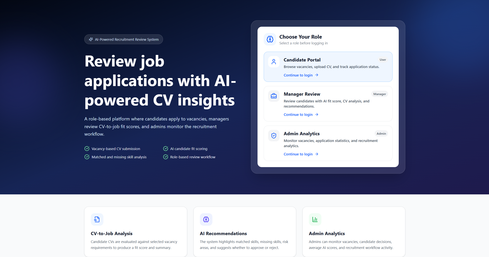
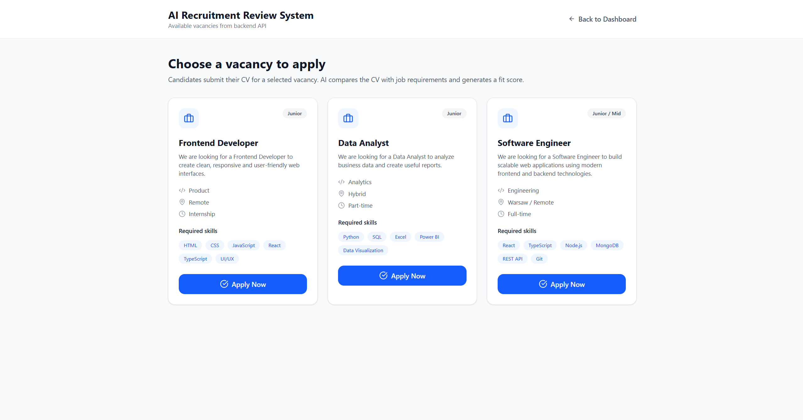
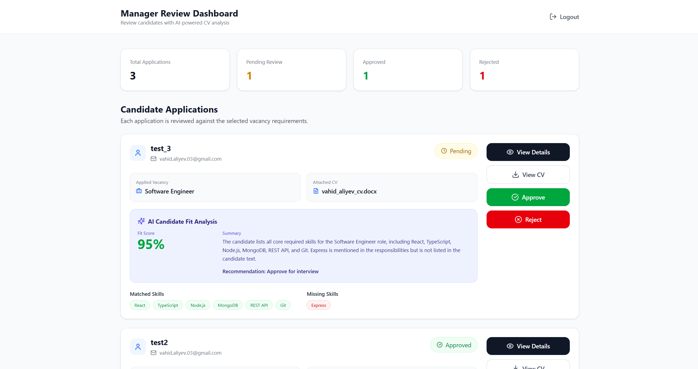
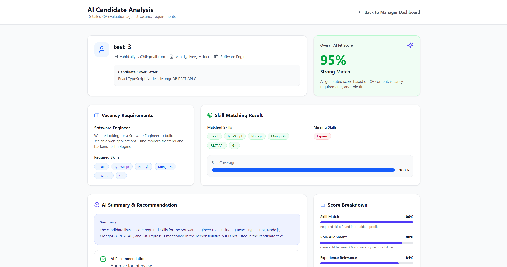
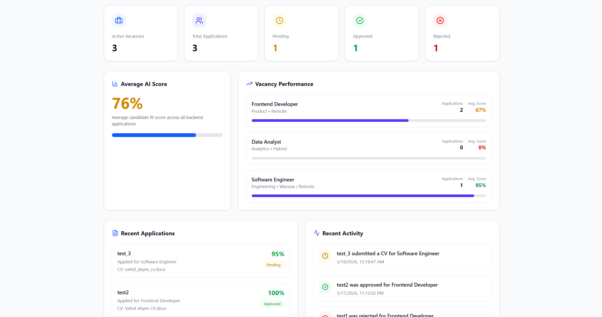

# AI Smart Application System

AI-powered role-based recruitment application review system with vacancy-based CV submission, candidate evaluation, AI fit scoring, and manager approval workflow.

## Project Overview

This project is a multi-component IT system developed for the Development of Complex IT Systems course.

The system allows candidates to apply for predefined vacancies by submitting their CV and motivation text. The backend analyzes the candidate application against vacancy requirements and generates an AI-based fit score, matched skills, missing skills, summary, and recommendation.

Managers can review applications, approve or reject candidates, and view detailed AI analysis. Admins can monitor vacancies, applications, decision statistics, and average AI scores.

## Screenshots

### Login Page


### Vacancies Page


### Manager Dashboard


### AI Analysis Page


### Admin Dashboard


## Main Features

- Role-based entry flow: Candidate, Manager, Admin
- Vacancy listing from backend API
- Candidate application submission
- CV filename upload simulation
- Backend-generated AI analysis
- Matched and missing skills detection
- AI fit score and recommendation
- Manager approve / reject workflow
- Decision confirmation modal
- Admin analytics dashboard
- MongoDB Atlas database integration
- OpenAI service skeleton with fake AI fallback

## Tech Stack

### Frontend
- React
- TypeScript
- Vite
- Tailwind-style utility classes
- Lucide React icons

### Backend
- Node.js
- Express.js
- TypeScript
- MongoDB
- Mongoose
- OpenAI SDK

### Database
- MongoDB Atlas

## Project Structure

```text
ai-smart-application-system/
├── frontend/
│   ├── src/
│   ├── package.json
│   └── vite.config.ts
│
├── backend/
│   ├── src/
│   │   ├── config/
│   │   ├── controllers/
│   │   ├── models/
│   │   ├── routes/
│   │   ├── seed/
│   │   ├── services/
│   │   └── server.ts
│   ├── package.json
│   └── .env.example
│
├── .gitignore
└── README.md
```

## Backend API Endpoints

### Health Check

GET /api/health

### Vacancies

GET /api/vacancies
GET /api/vacancies/:id
POST /api/vacancies

### Applications

GET /api/applications
GET /api/applications/:id
POST /api/applications
PATCH /api/applications/:id/status

## Environment Variables

Create a .env file inside the backend folder:

PORT=5000
MONGO_URI=your_mongodb_atlas_connection_string
OPENAI_API_KEY=your_openai_api_key
USE_REAL_AI=false

For demo mode, keep:

USE_REAL_AI=false

This uses the fake AI analysis service instead of the real OpenAI API.

## How to Run the Project

### 1. Clone the repository

git clone https://github.com/vahid2104/ai-smart-application-system.git
cd ai-smart-application-system

### 2. Install backend dependencies

cd backend
npm install

### 3. Start backend

npm run dev

Backend runs on:

http://localhost:5000

### 4. Install frontend dependencies

Open a new terminal:

cd frontend
npm install

### 5. Start frontend

npm run dev

Frontend runs on:

http://localhost:5173

## Seed Demo Vacancies

To insert demo vacancies into MongoDB Atlas:

cd backend
npm run seed:vacancies

This creates demo vacancies such as:

- Software Engineer
- Frontend Developer
- Data Analyst

## Demo Workflow

1. Candidate enters the system
2. Candidate browses vacancies
3. Candidate applies for a vacancy and uploads CV filename
4. Backend generates AI analysis
5. Manager reviews candidate application
6. Manager approves or rejects candidate
7. Admin dashboard updates statistics

## AI Analysis Logic

Currently, the project uses a fake AI analysis fallback for demo purposes.

The fake AI service compares the candidate cover letter with vacancy required skills and generates:

- AI fit score
- Matched skills
- Missing skills
- Summary
- Recommendation

The project also includes an OpenAI service skeleton for future real AI integration.

## Course Requirement Alignment

This project demonstrates:

- Custom coded frontend and backend components
- MongoDB database integration
- AI-based analysis component
- Role-based workflow
- Multi-step business process
- Approval and rejection paths
- Admin and reporting dashboard
